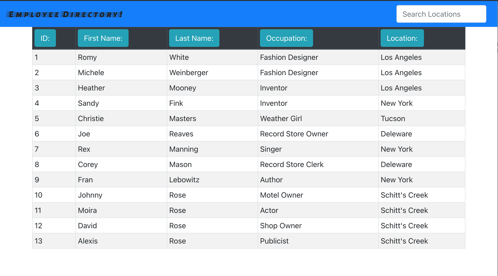

# **Employee Directory**

## Description
An application that allows the user to load a random list of employees and allows the user to sort and filter the list

**Links to [GitHub Repo](https://github.com/ohnobenito/employee-directory) and [Deployed Page](https://ohnobenito.github.io/employee-directory/)**

## Table of Contents
[1. Description](#Description) 
[2. License](License) 
[3. Contributing](#Contributing) 
[4. Tests](#Tests) 
[5. Authors](#Authors) 
[6. Questions](#Questions) 

## License
This application is covered by the MIT license. Full documentation can be found [here](https://choosealicense.com/licenses/mit).

## Contributing
Pull requests are welcome. For major changes, please open an issue first to discuss what you would like to change.

## Tests
Please make sure to update tests as appropriate.

## Authors
This application was created by Benito Gonzalez.

## Questions
Follow me on GitHub here: [Github](https://www.github.com/Ohnobenito) 
Have additional questions? Contact Benito Gonzalez by email: ohnobenito@gmail.com
